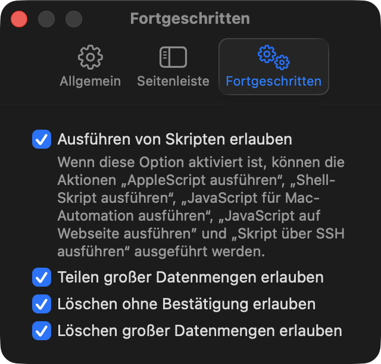
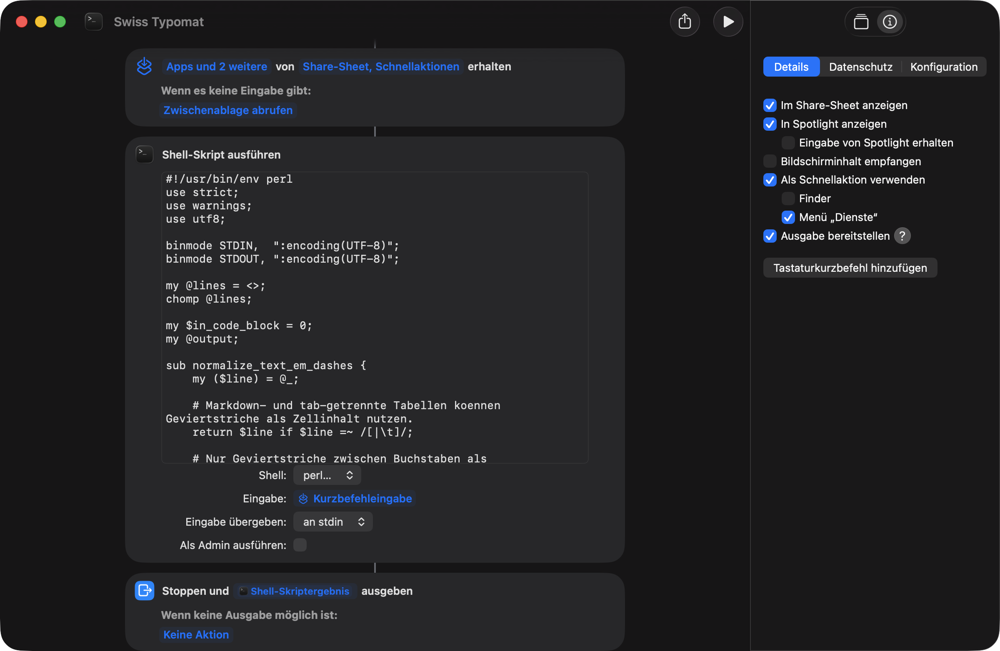
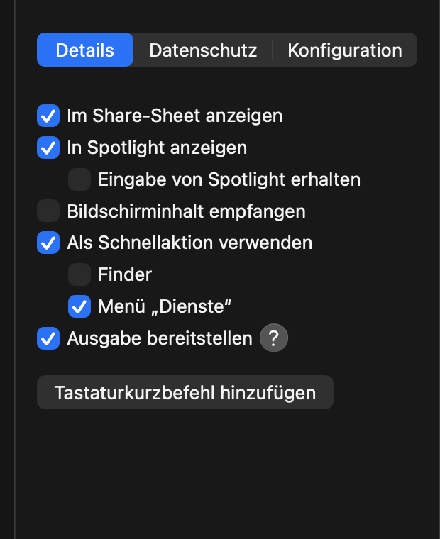
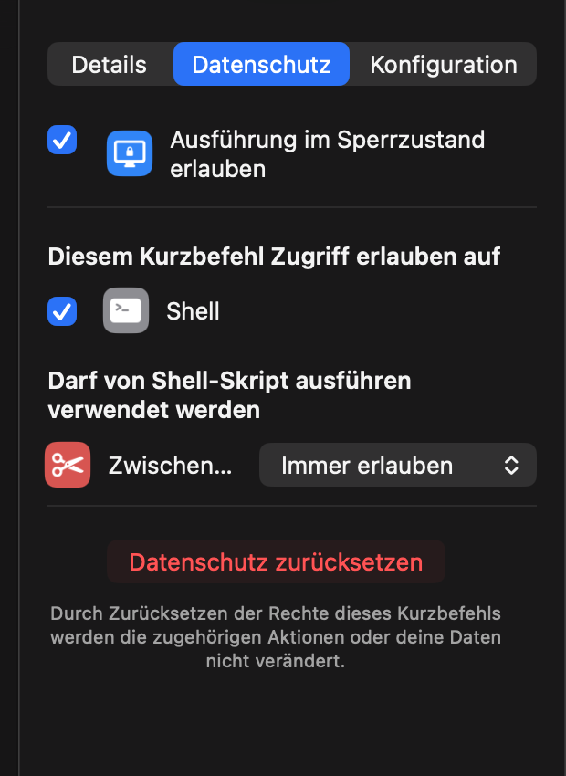

# Typomat

Typomat ist eine kleine Sammlung von macOS-Kurzbefehlen und Perl-Scripts, die
LLM-Text in typografisch sauberes Deutsch umwandeln.

Der Fokus liegt auf Texten, die aus ChatGPT, Claude, Gemini, Notion, Google Docs
oder Webseiten kopiert werden und danach schnell korrigiert werden sollen:
Anführungszeichen, Gedankenstriche, Schweizer `ss`, Zahlenformate und typische
Mischformen.

Typomat läuft lokal auf dem Mac. Die Kurzbefehle sind für **macOS** gedacht,
nicht für iOS oder iPadOS, weil sie die macOS-Aktion **Shell-Skript ausführen**
mit Perl verwenden.

Warum das wichtig ist: [Typografie ist die Rhetorik der Schrift](docs/essay-typografie-und-ki.md).

## Varianten

| Script | Region | Anführungszeichen | `ß` | Grosse Zahlen |
| --- | --- | --- | --- | --- |
| `scripts/swiss-diplomat.pl` | Schweiz | `«Text»` | `ss` | `100'000` |
| `scripts/german-diplomat.pl` | Deutschland | `„Text“` | bleibt `ß` | `100.000` |
| `scripts/german-guillemets-diplomat.pl` | Deutschland, alternativ | `»Text«` | bleibt `ß` | `100.000` |

## Beispiele

### Swiss-Diplomat

```text
"Grüße" aus dem KI-Text—aber bitte sauber: 100.000 Zeichen.
```

wird zu:

```text
«Grüsse» aus dem KI-Text – aber bitte sauber: 100'000 Zeichen.
```

### German-Diplomat

```text
"Grüße" aus dem KI-Text—aber bitte sauber: 100'000 Zeichen.
```

wird zu:

```text
„Grüße“ aus dem KI-Text – aber bitte sauber: 100.000 Zeichen.
```

### German-Diplomat mit Guillemets

```text
"Grüße" aus dem KI-Text—aber bitte sauber: 100'000 Zeichen.
```

wird zu:

```text
»Grüße« aus dem KI-Text – aber bitte sauber: 100.000 Zeichen.
```

## Was wird umgewandelt?

- Gerade, deutsche, englische oder gemischte Anführungszeichen werden in die
  Zielvariante umgewandelt.
- Verschachtelte Anführungszeichen werden auf die zweite Ebene korrigiert:
  `«Text «Zitat» Text»` wird in der Schweiz zu `«Text ‹Zitat› Text»`.
- Geviertstriche, doppelte Bindestriche und spaced hyphens zwischen Wörtern
  werden zu Gedankenstrichen mit Leerzeichen: `Text—Text`, `Text--Text` und
  `Text - Text` werden zu `Text – Text`.
- Echte Divis-Verbindungen ohne Leerzeichen bleiben erhalten:
  `text-text` bleibt `text-text`.
- Tabellenzellen werden mitkorrigiert: `| Text—Text |` wird zu
  `| Text – Text |`.
- Zahlenbereiche werden als Bis-Strich gesetzt: `1-2` und `10 - 12` werden zu
  `1–2` und `10–12`.
- Preis-Abkürzungen werden lokalisiert: Schweiz `29.--` zu `29.–`, Deutschland
  `29.--` zu `29,–`.
- Dezimalzeichen bei Preisen werden nur in klaren Währungskontexten korrigiert:
  Schweiz `CHF 29,95` zu `CHF 29.95`, Deutschland `29.95 €` zu `29,95 €`.
- Drei Punkte werden zu einem Auslassungszeichen: `...` wird zu `…`.
- Überflüssige Leerzeichen vor `,;:!?` werden entfernt.
- Codeblöcke mit dreifachen Backticks und Inline-Code in Backticks bleiben
  unverändert.
- Satzzeichen werden nicht aus Anführungszeichen herausgeschoben:
  `"So bleibt es."` wird in der Schweiz zu `«So bleibt es.»`.
- URLs, E-Mail-Adressen, IPv4-/IPv6-Adressen, Versionsnummern, Datumswerte,
  Markdown-Links und Dateipfade werden vor der Umwandlung geschützt.
- IPv4-Adressen werden nicht über feste Präfixe wie `192.` erkannt, sondern als
  gültige vierteilige Adresse mit Oktetten von `0` bis `255`.

## Schnellstart im Terminal

Voraussetzung: macOS bringt Perl bereits mit. Es muss nichts installiert werden.

```bash
pbpaste | perl scripts/swiss-diplomat.pl | pbcopy
```

Danach liegt der bereinigte Text wieder in der Zwischenablage.

Für Deutschland:

```bash
pbpaste | perl scripts/german-diplomat.pl | pbcopy
```

## Testen

Im Ordner `examples/` liegt ein Testtext mit typischen Problemstellen:
Anführungszeichen-Mischmasch, Gedankenstriche, Divis, IP-Adressen, Versionen,
Datumswerte, URLs, Markdown, Code und Zahlen.

```bash
perl scripts/swiss-diplomat.pl < examples/test-text.md
perl scripts/german-diplomat.pl < examples/test-text.md
```

Automatisch gegen die erwarteten Ausgaben prüfen:

```bash
./scripts/test.sh
```

## macOS-Kurzbefehl als Schnellaktion

So richtest du Typomat so ein, dass du Text markieren, mit der rechten Maustaste
klicken und den passenden Diplomat im Kontextmenü **Schnellaktionen** oder
**Dienste** ausführen kannst.

### 1. Scripts in Kurzbefehle erlauben

Öffne in der App **Kurzbefehle** die Einstellungen und wechsle zu
**Fortgeschritten**. Aktiviere dort mindestens **Ausführen von Skripten
erlauben**. Für lange Texte ist **Teilen grosser Datenmengen erlauben**
ebenfalls sinnvoll.



### 2. Neuen Kurzbefehl erstellen

1. Öffne die App **Kurzbefehle** auf dem Mac.
2. Erstelle einen neuen Kurzbefehl.
3. Benenne ihn zum Beispiel **Swiss-Diplomat** oder **German-Diplomat**.
4. Öffne rechts die Kurzbefehldetails über das Info-Symbol.

### 3. Kurzbefehl aufbauen

Der Kurzbefehl besteht aus drei Teilen:

1. **Eingabe empfangen**
   - Eingabe von **Share-Sheet** und **Schnellaktionen** erhalten.
   - Wenn keine Eingabe vorhanden ist: **Zwischenablage abrufen**.
2. **Shell-Skript ausführen**
   - Shell: **perl**
   - Eingabe: **Kurzbefehleingabe**
   - Eingabe übergeben: **an stdin**
   - Als Admin ausführen: **aus**
   - Inhalt des gewünschten Scripts aus `scripts/` einfügen.
3. **Stoppen und ausgeben**
   - Ergebnis: **Shell-Skriptergebnis**
   - Wenn keine Ausgabe möglich ist: **Keine Aktion**



### 4. Details einstellen

Aktiviere in den Details rechts:

- **Im Share-Sheet anzeigen**
- **Als Schnellaktion verwenden**
- **Menü "Dienste"**
- **Ausgabe bereitstellen**

So erscheint Typomat später per Rechtsklick in **Schnellaktionen** oder
**Dienste**.



### 5. Datenschutz erlauben

Wenn macOS beim ersten Ausführen fragt, ob der Kurzbefehl die Shell-Aktion oder
die Zwischenablage verwenden darf, erlaube den Zugriff. In den
Kurzbefehldetails sollte **Shell** erlaubt sein. Für die Zwischenablage ist
**Immer erlauben** am bequemsten.



## Verwendung

1. Markiere Text in einer App.
2. Klicke mit der rechten Maustaste.
3. Wähle **Schnellaktionen** oder **Dienste**.
4. Wähle **Swiss-Diplomat**, **German-Diplomat** oder die Guillemets-Variante.

In manchen Apps ersetzt macOS den markierten Text direkt. In anderen Apps wird
das Ergebnis angezeigt oder in die Zwischenablage gelegt. Wenn eine App das
Ersetzen nicht unterstützt, kopiere den Text zuerst, führe den Kurzbefehl aus
und füge das Ergebnis danach ein.

## Datenschutz

Typomat läuft lokal auf deinem Mac. Der Text wird nicht an eine API, einen
Server oder einen externen Dienst gesendet.

## Grenzen

Typomat ist bewusst ein pragmatischer Textfilter und kein vollständiger
Grammatik-Parser.

- Mehrzeilige oder verschachtelte Anführungszeichen können eine manuelle
  Kontrolle brauchen.
- Geviertstriche in Markdown-Tabellen werden geschützt; dadurch werden darin
  absichtlich keine Gedankenstriche korrigiert.
- Apostrophe in Namen oder englischen Wörtern werden nicht als
  Anführungszeichen behandelt.
- Die Erkennung ist konservativ: Lieber bleibt ein zweifelhafter Fall
  unverändert, als dass Code, URLs, IP-Adressen oder Versionsnummern beschädigt
  werden.

## iCloud-Shortcuts

Die iCloud-Links zu den fertigen Kurzbefehlen werden hier ergänzt:

- Swiss-Diplomat: folgt
- German-Diplomat: folgt
- German-Diplomat mit Guillemets: folgt
