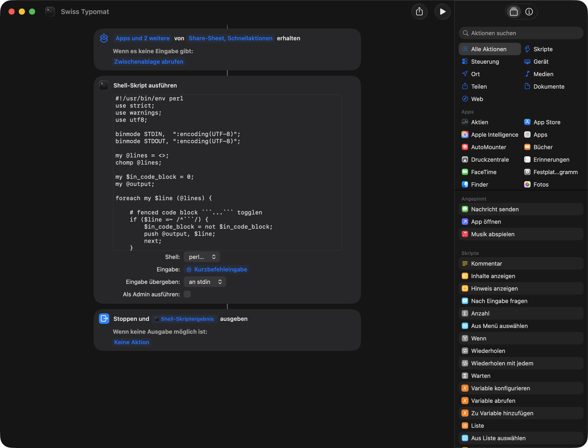

# macOS-Kurzbefehl einrichten

Diese Anleitung beschreibt, wie du einen Typomat-Diplomat in der Kurzbefehle-App
als Schnellaktion einrichtest.

Typomat funktioniert als Kurzbefehl nur unter macOS. Auf iPhone und iPad fehlt
die hier verwendete macOS-Aktion **Shell-Skript ausführen** mit Perl.

## Fertige Kurzbefehle installieren

Du kannst die fertigen Kurzbefehle direkt über iCloud hinzufügen:

| Kurzbefehl | Link |
| --- | --- |
| Swiss Typomat | [Kurzbefehl hinzufügen](https://www.icloud.com/shortcuts/0cb78b98b8734bdda6595df4d7b7f326) |
| German Typomat `„…“` | [Kurzbefehl hinzufügen](https://www.icloud.com/shortcuts/86c17cb2263c46ad805a5d9448f1d341) |
| German Typomat `»…«` | [Kurzbefehl hinzufügen](https://www.icloud.com/shortcuts/0c8d49d9a3b44df9ad58645878e86d40) |

Wenn du den Kurzbefehl selbst nachbauen oder kontrollieren möchtest, folge den
Schritten unten.

## 1. Script-Ausführung erlauben

Öffne in der Kurzbefehle-App die Einstellungen, wechsle zu **Fortgeschritten**
und aktiviere **Ausführen von Skripten erlauben**.

Optional ist **Teilen grosser Datenmengen erlauben** sinnvoll, wenn du lange
Texte umwandelst.

## 2. Neuen Kurzbefehl erstellen

1. Öffne **Kurzbefehle**.
2. Erstelle einen neuen Kurzbefehl.
3. Benenne ihn zum Beispiel **Swiss-Diplomat** oder **German-Diplomat**.

## 3. Gesamten Kurzbefehl aufbauen

Der Kurzbefehl besteht aus drei Aktionen:

1. Eingabe empfangen.
2. Shell-Skript ausführen.
3. Stoppen und Shell-Skriptergebnis ausgeben.

## 4. Eingabe konfigurieren

Der Kurzbefehl soll markierten Text aus Apps übernehmen können.

1. Öffne die Details des Kurzbefehls.
2. Aktiviere **Als Schnellaktion verwenden**.
3. Aktiviere **Share-Sheet** und **Schnellaktionen**.
4. Stelle **Wenn es keine Eingabe gibt** auf **Zwischenablage abrufen**.

## 5. Shell-Skript-Aktion hinzufügen

1. Füge die Aktion **Shell-Skript ausführen** hinzu.
2. Wähle als Shell **perl**.
3. Stelle **Eingabe** auf **Kurzbefehleingabe**.
4. Stelle **Eingabe übergeben** auf **an stdin**.
5. Lasse **Als Admin ausführen** ausgeschaltet.
6. Kopiere den Inhalt des gewünschten Scripts aus `scripts/` in die Aktion.

## 6. Ergebnis ausgeben

Füge am Ende die Aktion **Stoppen und ausgeben** hinzu.

Als Ergebnis wählst du **Shell-Skriptergebnis**.

## 7. Details einstellen

Aktiviere rechts in den Kurzbefehldetails:

- **Im Share-Sheet anzeigen**
- **Als Schnellaktion verwenden**
- **Menü "Dienste"**
- **Ausgabe bereitstellen**

## 8. Datenschutz erlauben

Wenn macOS nach Berechtigungen fragt, erlaube die Verwendung der Shell-Aktion
und der Zwischenablage.

## 9. Benutzung

1. Markiere Text.
2. Klicke mit der rechten Maustaste.
3. Wähle **Schnellaktionen** oder **Dienste**.
4. Starte den gewünschten Diplomat.

Nicht jede App erlaubt das direkte Ersetzen von markiertem Text. Wenn es nicht
klappt, kopiere den Text zuerst, führe den Kurzbefehl aus und füge das Ergebnis
danach wieder ein.
